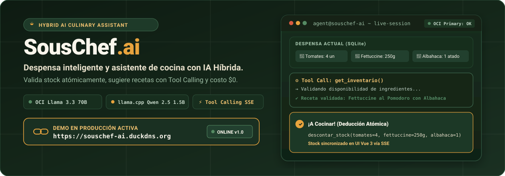
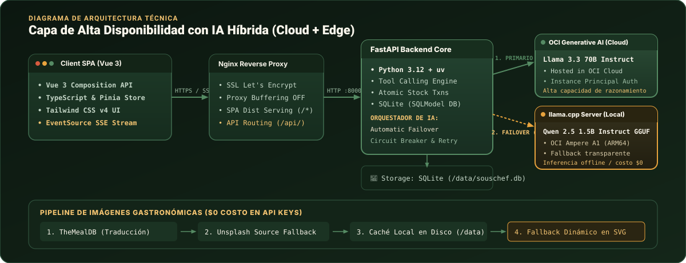

<p align="center">
  
</p>

<p align="center">
  <a href="https://souschef-ai.duckdns.org"></a>
  
  <a href="LICENSE"></a>
  
  
  
  
  
</p>

---

> [!TIP]
> ### 🌐 **Prueba la Demo en Producción:** [https://souschef-ai.duckdns.org](https://souschef-ai.duckdns.org)
> Accede a la instancia en vivo desplegada en Oracle Cloud Infrastructure (Always Free). Administra la despensa, chatea con el asistente en tiempo real y cocina recetas con deducción atómica de inventario.

---

## ¿Qué es SousChef.ai?

**SousChef.ai** es una plataforma integral de gestión de despensa y asistencia culinaria impulsada por una arquitectura de **IA Híbrida con alta disponibilidad y costo $0 de inferencia**. 

Permite controlar existencias de alimentos mediante una interfaz moderna en Vue 3 y colaborar con un agente culinario inteligente que inspecciona el inventario en tiempo real mediante **Tool Calling**, propone recetas personalizadas basadas estrictamente en lo disponible y descuenta los ingredientes utilizados de manera atómica al momento de cocinar.

### Pilares del Proyecto

- **Despensa en Tiempo Real**: CRUD reactivo con categorización, alertas de stock mínimo y sincronización de unidades de medida.
- **Agente con Tool Calling Autónomo**: El modelo de lenguaje consulta la despensa (`get_inventario`) y ejecuta transacciones de stock (`descontar_stock`) de forma transparente sin inventar ingredientes que el usuario no tiene.
- **IA Híbrida Resiliente (Cloud + Edge)**:
  1. **Primario**: [OCI Generative AI](https://docs.oracle.com/en-us/iaas/Content/generative-ai/overview.htm) (`Llama 3.3 70B Instruct`) para razonamiento culinario avanzado en la nube.
  2. **Fallback Local**: [llama.cpp](https://github.com/ggml-org/llama.cpp) (`Qwen 2.5 1.5B Instruct GGUF`) alojado en el propio servidor ARM64 para conmutación automática y transparente ante fallas de red, latencia o cuota.
- **Pipeline Gastronómico sin Costo ($0 API Keys)**: Búsqueda y enriquecimiento de imágenes gastronómicas combinando TheMealDB con traducción culinaria y Unsplash Source, con caché persistente en disco y respaldo dinámico en SVG.
- **Deducción de Stock Atómica**: Control estricto de concurrencia e integridad en SQLite mediante transacciones normalizadas.

---

## Arquitectura de la Solución

<p align="center">
  
</p>

### Protocolo de Streaming SSE (`POST /api/chat`)

La comunicación entre el cliente y el agente se realiza vía **Server-Sent Events (SSE)** con soporte de streaming token a token y retroalimentación interactiva del estado:

| Evento SSE | Descripción | Payload |
|---|---|---|
| `provider_info` | Indica qué proveedor de IA está respondiendo y si se activó fallback | `{"provider": "oci" \| "local", "fallback": boolean}` |
| `token` | Fragmento incremental de texto generado en streaming | `{"text": "..."}` |
| `tool_call` | Notifica la invocación de una herramienta por parte del agente | `{"tool": "get_inventario" \| "descontar_stock", "args": {...}}` |
| `tool_result` | Resultado de la ejecución de la herramienta en el backend | `{"status": "ok", "data": [...]}` |
| `recipe` | Estructura canónica de la receta generada para la UI | `{"nombre": "...", "ingredientes": [...], "pasos": [...]}` |
| `recipe_image` | URL o path de la imagen gastronómica resuelta | `{"url": "/static/recipes/..."}` |
| `done` | Cierre exitoso de la sesión de inferencia | `{"status": "complete"}` |

---

## Stack Tecnológico

| Capa | Tecnologías |
|---|---|
| **Frontend** | Vue 3 (Composition API con `<script setup>`), TypeScript, Pinia, Vue Router, Tailwind CSS, `marked` + `dompurify`, Vite, Vitest |
| **Backend** | Python 3.12, FastAPI, SQLModel (SQLite), `oci-openai`, httpx, uv, Ruff, Pytest |
| **IA Primaria** | OCI Generative AI Service (`meta.llama-3.3-70b-instruct`) con autenticación Instance Principal |
| **IA Local / Edge** | llama.cpp (`llama-server`) corriendo `Qwen2.5-1.5B-Instruct-Q4_K_M.gguf` optimizado para ARM64 Neon |
| **Infraestructura** | Oracle Cloud Infrastructure (OCI) Always Free (Ampere A1 Flex ARM64, 2 OCPU, 12 GB RAM) |
| **DevOps & Proxy** | Terraform, Docker Compose multi-arch, Nginx Reverse Proxy con SSL automático (Certbot / Let's Encrypt) |

---

## Configuración de Entorno

Copia la plantilla de variables de entorno y ajusta los parámetros necesarios:

```bash
cp .env.example .env
```

### Variables en `.env`

| Variable | Default | Descripción |
|---|---|---|
| `LLM_PROVIDER` | `oci` | Proveedor primario activo (`oci` o `local`) |
| `AI_FALLBACK_ENABLED` | `true` | Conmutación automática a `llama.cpp` si OCI presenta fallas o timeout |
| `OCI_COMPARTMENT_ID` | — | OCID del Compartment en Oracle Cloud |
| `OCI_REGION` | `us-ashburn-1` | Región configurada en OCI |
| `OCI_MODEL_ID` | `meta.llama-3.3-70b-instruct` | Identificador del modelo fundacional en OCI |
| `OCI_AUTH_TYPE` | `api_key` | `api_key` (desarrollo local) o `instance_principal` (en instancia VM de OCI) |
| `LOCAL_LLM_BASE_URL` | `http://llama-cpp:8080/v1` | Endpoint compatible OpenAI de llama.cpp |
| `LOCAL_LLM_MODEL` | `qwen2.5-1.5b` | Identificador del modelo local |
| `IMAGE_SOURCE` | `web` | `web` (TheMealDB + Unsplash) o `none` (modo offline/tests) |
| `DATABASE_URL` | `sqlite:////data/souschef.db` | Ruta de la base de datos persistente SQLite |
| `ALLOW_ORIGINS` | `http://localhost,https://souschef-ai.duckdns.org` | Orígenes habilitados para CORS |

---

## Desarrollo Local

### Opción A: Con Docker Compose (Recomendada)

1. **Descarga del modelo GGUF (opcional para inferencia local):**
   ```bash
   mkdir -p models
   # Ubica Qwen2.5-1.5B-Instruct-Q4_K_M.gguf en el directorio models/
   ```

2. **Iniciar todos los servicios (Backend, Frontend y llama.cpp):**
   ```bash
   docker compose up --build
   ```
   Accede a [http://localhost](http://localhost) en tu navegador.

### Opción B: Ejecución Nativa (Bare-Metal)

1. **Motor LLM Local (opcional):**
   ```bash
   ./scripts/serve_local.sh
   ```

2. **Backend (FastAPI con `uv`):**
   ```bash
   cd backend
   uv sync
   uv run fastapi dev
   ```
   Disponible en [http://localhost:8000](http://localhost:8000) (Swagger en `/docs`).

3. **Frontend (Vite + Vue 3):**
   ```bash
   cd frontend
   npm install
   npm run dev
   ```
   Disponible en [http://localhost:5173](http://localhost:5173).

---

## Despliegue en Producción (Oracle Cloud Always Free)

La infraestructura en la nube está completamente automatizada con **Terraform** para ejecutarse de forma permanente sin costo en el tier Always Free de Oracle Cloud (Ampere A1 ARM64).

```
VCN (10.0.0.0/16) ──► Subred Pública ──► Security Lists (80, 443, 22)
                           │
                           ▼
             Instancia Ampere A1 ARM64 (2 OCPU / 12 GB RAM)
             ├── Dynamic Group + IAM Policy (Instance Principal)
             ├── Nginx + Certbot Let's Encrypt (SSL Auto-renew)
             ├── FastAPI Backend Container
             └── llama.cpp Server Container (Qwen 2.5 1.5B ARM64)
```

### Pasos de Despliegue

1. **Provisionar Infraestructura con Terraform:**
   ```bash
   cd terraform
   cp terraform.tfvars.example terraform.tfvars
   # Completa tus credenciales de OCI y clave SSH pública
   terraform init
   terraform apply
   ```

2. **Transferir el modelo GGUF a la instancia:**
   ```bash
   scp ../models/Qwen2.5-1.5B-Instruct-Q4_K_M.gguf opc@<IP_PUBLICA>:/opt/souschef/models/
   ```

3. **Configuración de Dominio (DNS):**
   Crea un registro **A** apuntando el dominio (ej. `souschef-ai.duckdns.org`) a la IP pública de la instancia.

4. **Despliegue y Emisión SSL:**
   ```bash
   ssh opc@<IP_PUBLICA>
   bash /opt/souschef/app/scripts/deploy_oci.sh
   ```

La plataforma quedará operativa en `https://souschef-ai.duckdns.org` con renovación automática de certificados SSL.

---

## Verificación de Calidad y Tests

El proyecto cuenta con una cobertura de pruebas exhaustiva tanto en el backend como en el frontend:

```bash
# Backend: Tests unitarios, de integración y tool calling (64 tests)
cd backend && uv run pytest

# Backend: Linter y formato de código con Ruff
cd backend && uv run ruff check .

# Frontend: Tests unitarios de componentes, stores y vistas (73 tests)
cd frontend && npm test -- --run

# Frontend: Chequeo estricto de tipos con vue-tsc
cd frontend && npm run type-check
```

---

## Licencia

Distribuido bajo la Licencia **MIT**. Consulta el archivo [LICENSE](LICENSE) para más información.
